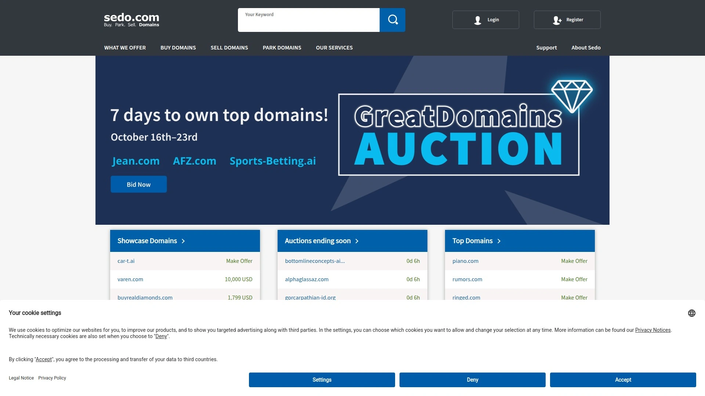
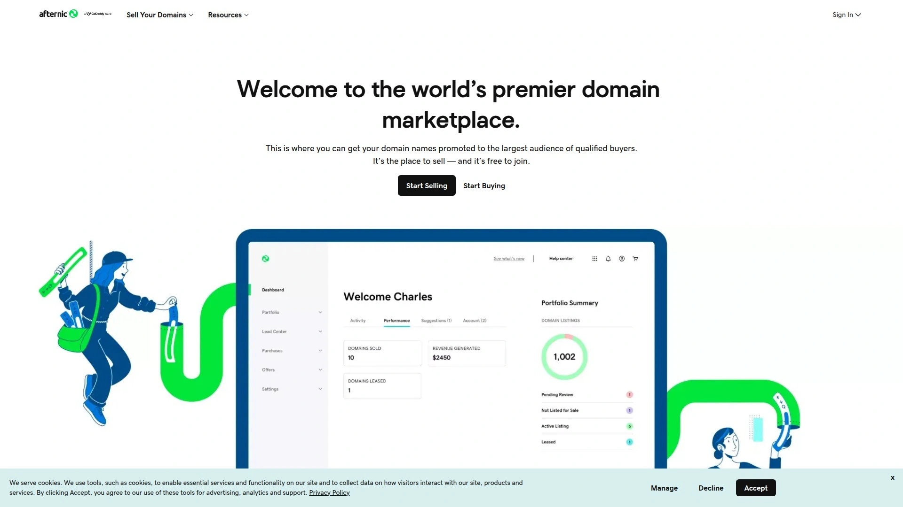
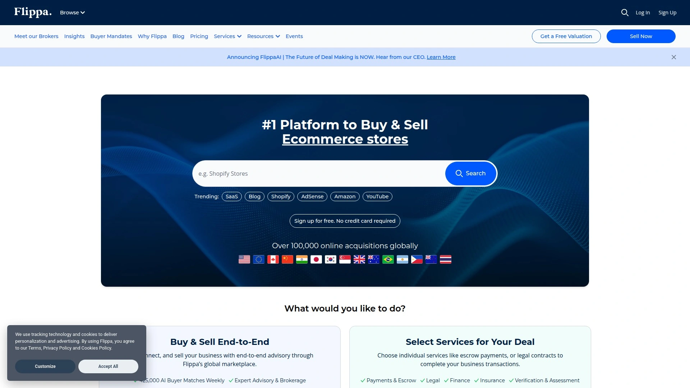
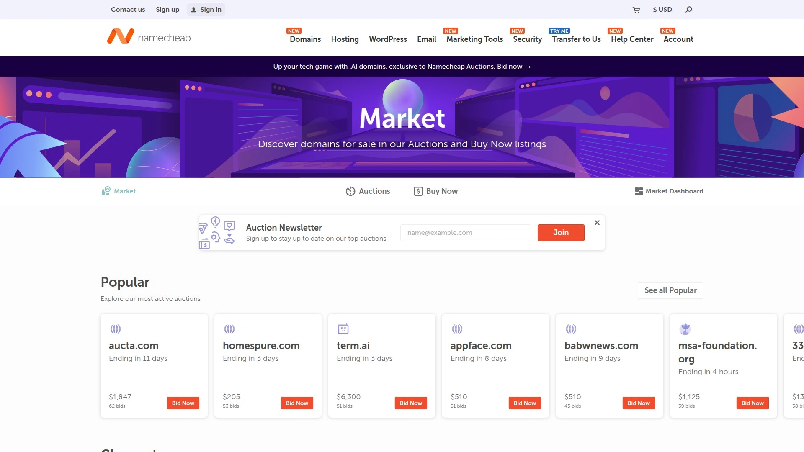
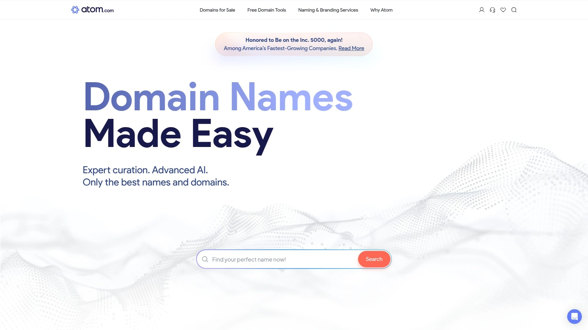
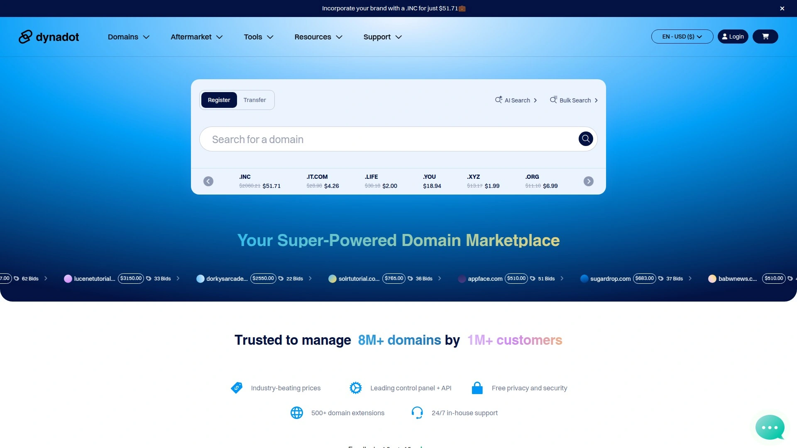
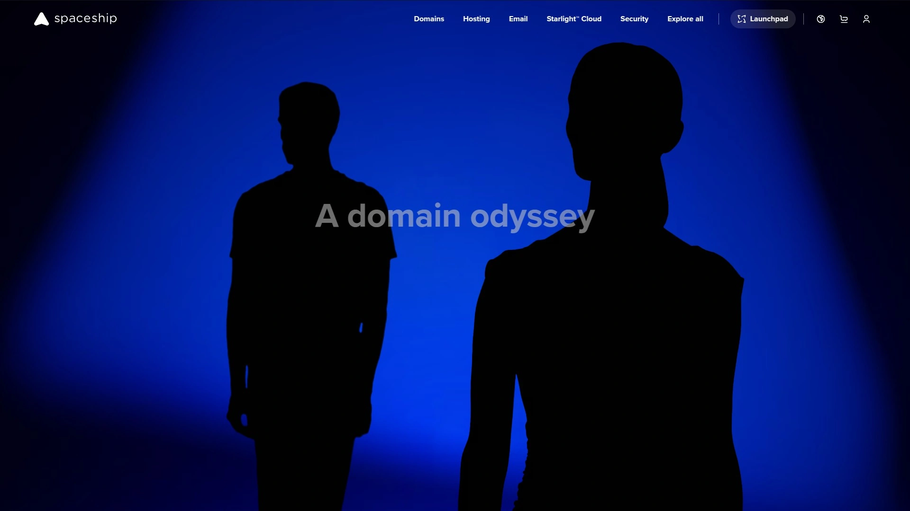
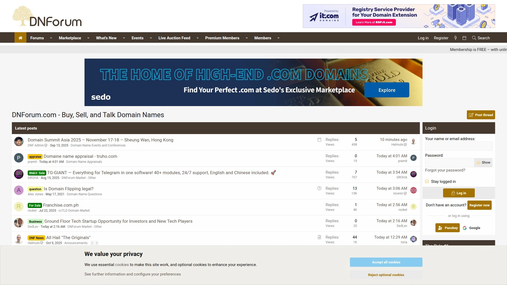
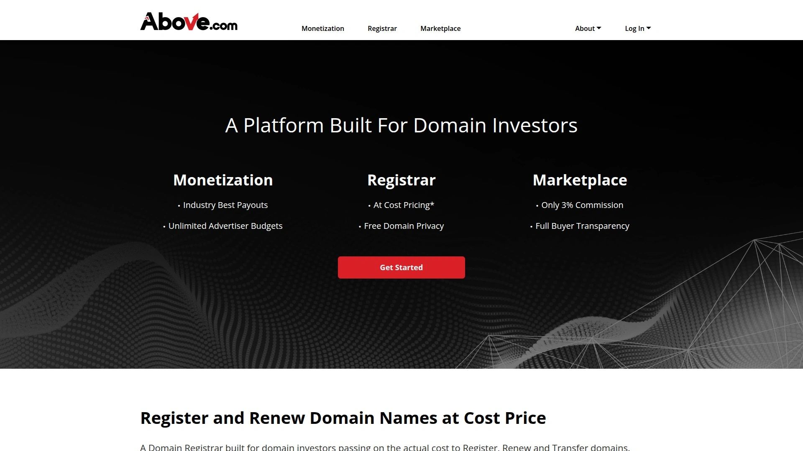

# 2025年十二大最佳域名交易平台完整榜单(近期更新)

买卖域名最头疼的事情,就是不知道在哪个平台能卖出合理价格,或者担心交易过程中遇到诈骗和纠纷无人处理。专业的域名交易平台提供安全托管服务、全球买家网络、多种销售方式(固定价格/拍卖/议价),让你的域名在1900万买家面前曝光并以最佳价格成交。无论是初创公司寻找品牌域名、投资者建立域名组合,还是个人出售闲置域名变现,这份榜单覆盖从大型综合市场到精品策展平台的12个全球方案,帮你找到最适合域名类型和交易目标的交易渠道。

## **[Sedo](https://sedo.com)**

全球最大域名交易市场,1900万域名库存和超低10%卖方佣金。

Sedo成立于1999年,总部位于德国科隆,是世界领先的域名交易平台之一。平台汇集来自全球各地的卖家,提供超过1900万个待售域名条目,构成行业内最大和最佳的域名选择库。

**买家优势**体现在智能搜索功能精准定位目标域名、浏览庞大域名目录、查看当前市场新闻和趋势。购买方式灵活多样,包括固定价格(Buy Now)、拍卖(Auction)和匿名协商(Negotiation)三种模式。选择电汇作为支付方式时,买家仅需支付域名价格本身,无任何额外费用,可靠的转移服务完全免费包含在内。

**卖家优势**更加突出,Sedo是全球买家数量最多的域名市场,使用其服务可以快速以合适价格出售域名,同时享受特别低的销售费用。销售选项包括Buy Now(固定价格,售出速度比其他方式快3倍)、Make Offer(接受报价并协商)、Marketplace Auction(收到首个报价后启动拍卖)、Direct Auction(自主发起拍卖,首页展示)、Auction Events(专家策划的双月GreatDomains拍卖)和Brokerage Service(高价值域名专业经纪服务)。

**费用结构**极具竞争力,如果域名设置Buy Now价格并通过Sedo停放激活广告页或销售落地页,直接通过Sedo市场售出时佣金仅10%。其他情况下(Make Offer或拍卖)佣金为15%,通过SedoMLS网络售出佣金为20%。最低价格从20美元起,许多域名以低于2500美元成交,匿名快速协商功能保护双方隐私。

平台与超过650个国际合作伙伴建立网络,最大化域名曝光度。免费域名停放、免费域名转移和免费域名注册等附加服务增加平台吸引力。Reddit社区普遍认可Sedo的合法性,虽然部分用户反映列表域名未售出的情况,但平台20多年的运营历史和庞大用户基础证明其可信度。

## **[Afternic](https://www.afternic.com)**

世界顶级域名市场和交换转售商,Fast Transfer快速转移成交率最高。

Afternic是一站式域名购买、销售和停放网站,作为世界顶级域名市场和交换转售商享有盛誉。平台最著名的功能是Fast Transfer快速转移计划,被Reddit用户评为"毫无疑问表现最佳的市场"。

Fast Transfer的工作原理是将域名列表分发到多个注册商的销售网络,当买家在GoDaddy、Name.com等合作注册商搜索域名时,Afternic的列表会出现在搜索结果中。这种广泛分发机制极大增加域名曝光度和成交概率。

GoDaddy在2024年4月宣布将资源集中在Afternic以更好服务域名卖家,从5月13日起不再接受新的Member to Member列表,建议所有卖家使用Afternic,域名将继续通过联合方式在GoDaddy Auctions平台和搜索中获得额外曝光。这一战略调整凸显Afternic在GoDaddy生态系统中的核心地位。

Dan.com在2025年6月27日完全关闭后,其许多创新功能(如Lease to Own分期付款)已整合到GoDaddy的Aftermarket产品中,进一步增强Afternic的功能性。适合希望获得最广泛分发网络、追求最高成交率、已在GoDaddy注册域名的卖家。

## **[GoDaddy Auctions](https://auctions.godaddy.com)**

全球最大注册商的拍卖平台,专注过期域名和高价值抢注。

GoDaddy Auctions是GoDaddy品牌下的域名拍卖服务,专注于域名二级市场(Aftermarket)。平台定位已从综合卖家平台转向更专注买家侧的服务,特别强调过期域名和即将过期域名的拍卖。

**域名二级市场**是指买家尝试获取已被注册、最近过期或即将过期域名的次级市场。GoDaddy Auctions提供的列表类型包括7天拍卖、即购即得、报价/还价和过期拍卖。

**代理竞价系统**是平台特色功能,买家输入最高出价金额后,系统会自动以最小增量超过当前最高出价,每次被超越时自动增加出价直到达到设定上限。这种机制避免用户持续监控拍卖进度,由系统代为竞价直到赢得或达到预算限制。

2025年10月15日,GoDaddy推出高端域名市场DomainNames.com,进一步巩固其在高价值域名交易领域的地位。需要注意的是,从2024年5月13日起新的Member to Member列表(包括7天公开拍卖、即购即得和报价/还价列表)已不再接受,现有进行中的拍卖会运行至结束,但Buy Now和Offer/Counteroffer列表已下架。

适合寻找过期域名捡漏机会、希望通过拍卖竞价获取心仪域名、已是GoDaddy用户的买家。Reddit社区有用户指出部分拍卖存在争议,建议谨慎评估域名价值后再参与竞价。

## **[Flippa](https://flippa.com)**

不仅交易域名还包含网站和应用的综合市场,2990万总价成交记录。

Flippa是流行的域名交易市场,同时支持网站、应用和其他在线业务的买卖。平台定位为买卖在线业务、网站、应用和域名的一站式市场。

**域名销售套餐**从29美元起,可选附加服务增加可见度。成功费用根据资产价值从3%到10%不等,Premium和M&A Brokered选项包括增强曝光、NDA支持和顾问服务等功能。

销售时间因域名质量、市场需求和定价策略而异,部分域名可能快速吸引买家,其他可能需要数周或数月才能售出。积极参与和适当的列表优化可以加快销售进程。

**域名价值评估**基于长度、关键词相关性、品牌性、扩展名(TLD)和市场需求等因素。简短、易记、包含热门关键词或.com扩展名的域名通常更有价值。平台提供工具和评估服务提供估值,但最终价值由买家愿意支付的金额决定。

高级域名通常简短、易记、包含流行关键词或品牌名称。由于品牌和搜索引擎优化(SEO)优势的潜力,这类域名市场需求高,稀缺性和吸引力推动其更高估值。

Reddit用户反馈显示Flippa适合同时出售域名和相关网站/业务,但纯域名销售可能不如专业域名市场有效。浏览数千个待售域名的域名分类页面提供丰富选择。

## **[Namecheap Marketplace](https://www.namecheap.com/market/)**

注册商自带交易市场,即购即得和域名拍卖双模式。

Namecheap Marketplace是Namecheap注册商提供的域名买卖平台,允许用户在拍卖中购买域名或立即购买抢占完美域名。作为知名域名注册商,Namecheap的市场功能与注册服务无缝集成,为现有用户提供便利。

平台支持两种购买模式:立即购买(Buy Now)和参与拍卖竞价。用户可以按扩展名、价格区间和域名长度过滤搜索结果,快速定位符合预算和需求的域名。

YouTube视频教程显示Namecheap Marketplace自动进入Premium网络,列出的所有.com域名(几乎全部)都在Premium网络中,意味着超过100个网站在转售或尝试销售用户列出的域名。这种自动联合分发机制增加域名曝光度。

域名售出后自动转移,卖家可以提取销售所得款项,整个流程简化无需手动干预。适合已在Namecheap注册大量域名、希望利用注册商整合服务、追求操作便利性的用户。

## **[BrandBucket](https://www.brandbucket.com)**

策展型品牌域名市场,每个域名配专业Logo的"盒装品牌"。

BrandBucket是精选品牌.com域名的专业市场,成立于2005年并在2007年启动市场。平台核心理念是提供"品牌盒装"解决方案,每个域名都经过精心挑选以确保其发展成强大、令人难忘品牌的潜力,并配有专业设计的Logo和透明、预先定价。

**策展模式**是BrandBucket的独特卖点,不接受所有域名提交,而是由专家团队挑选具有品牌潜力的域名上架。这种质量控制确保买家看到的每个域名都值得考虑,避免在海量低质域名中浪费时间。

库存从最初几千个品牌域名增长到超过10000个手工挑选的域名,全部在BrandBucket独家列出。2025年7月收购Novanym进一步扩大其在品牌域名领域的影响力,这是继2019年整合Brandroot后的第二次收购。

**网络效应**通过与多个初创公司焦点网站、合作市场和相关商业服务的整合,所有在BrandBucket平台独家列出的域名都能获得更广泛的曝光。Novanym的搜索引擎权威性将显著增强BrandBucket域名库存的可见度。

截至收购公告,BrandBucket已售出超过11000个域名,交易总额超过6400万美元。详细分析显示平台的销售记录和ROI(投资回报率)表现优异。Reddit用户讨论中,BrandBucket被认为适合寻找独特品牌名称而非通用关键词域名的买家。

需要注意的是,平台曾因列出可能侵犯商标的域名受到批评,买家需自行进行商标检查避免法律纠纷。适合初创公司寻找带Logo的完整品牌方案、重视品牌性胜过关键词SEO、预算允许支付溢价的企业家。

## **[Atom.com](https://www.atom.com)**

批发价域名市场,优质域名和大宗采购的一站式平台。

Atom.com将自己定位为"#1域名市场",专注于帮助用户找到最佳待售域名。平台特色是批发域名市场,允许买家以大宗价格购买域名。

**卖家服务**包括标准列表和高级市场两种选项。Atom市场现在允许卖家将10%的列表域名更改为"Make An Offer"模式,这会移除"Buy It Now"价格,潜在买家需要对域名提出报价。此外,卖家可以向买家提供付款计划选项。

任何优质域名都可以在Atom市场上出售,例外情况包括明确的"成人"域名和推广特定政治党派、人物或从属关系的名称。标准列表不需要将域名指向Atom,但在高级市场列出时,Atom要求卖家始终将域名指向其名称服务器。

**曝光升级**选项包括Retargeting(重新定向)、Logo Design(Logo设计)和Contest Entry(竞赛参赛)等附加服务,帮助提升域名可见度。确保域名的关键词和分类正确且相关也能提高销售概率。

价值评估基于多个因素,包括长度、关键词、发音简单程度、拼写直观性和品牌性。优质域名展示页面突出高价值域名选择。适合批发商和机构买家大宗采购域名、卖家希望提供分期付款吸引更多买家、重视附加服务如Logo设计的用户。

## **[Dynadot](https://www.dynadot.com)**

用户域名市场和拍卖双平台,注册商整合的便捷交易。

Dynadot是域名注册商和市场二合一平台,提供用户域名市场(User Domain Marketplace)服务。作为注册商提供市场功能,Dynadot为现有客户提供无缝的域名买卖体验。

平台支持用户列表(User Listings)和拍卖两种交易模式,卖家可以根据域名特点和销售策略选择合适方式。与Namecheap类似,注册商自带市场的优势在于域名管理和交易在同一账户完成,简化操作流程。

适合已在Dynadot注册域名、希望避免跨平台转移麻烦、追求一站式管理的用户。相比专业域名市场,注册商市场的买家流量可能较少,但对于中低价域名快速出售仍有价值。

## **[Spaceship SellerHub](https://www.spaceship.com)**

全球买家触达的域名销售平台,简单设置和强大管理工具。

Spaceship SellerHub是Spaceship.com提供的域名买卖平台,允许用户在Spaceship SellerHub上列出待售域名并触达全球买家受众。平台强调简单设置和强大的列表管理工具。

作为澳大利亚起家的域名注册商,Spaceship在亚太地区有一定知名度,SellerHub市场功能为其用户提供变现闲置域名的渠道。界面设计现代化,符合当代用户的审美和操作习惯。

适合亚太地区特别是澳大利亚和新西兰的域名持有者、寻找注册商整合市场功能、重视用户体验设计的卖家。

## **[NamePros](https://www.namepros.com)**

50万会员的域名社区论坛,拍卖和讨论兼具的专业平台。

NamePros是领先的域名社区论坛,拥有超过50万注册会员,包括域名买家、网站所有者和开发者。在NamePros域名市场,会员可以列出待售域名,这些域名被标记为拍卖(Auctions)、立即购买(Buy now)、特价(Bargains)和报价(Make an offer)。

**社区属性**是NamePros的核心价值,除了市场功能,用户可以在社区论坛找到关于建立业务、网站和域名创意的各种资源和讨论主题。这种知识分享环境帮助新手学习域名投资策略和行业最佳实践。

唯一缺点是界面不如Domain.com和Namecheap等现代化市场用户友好。论坛风格的布局对于习惯电商式购物体验的用户可能需要适应期。

适合域名投资者寻求专业讨论、希望从社区获得域名估值和销售建议、不介意传统论坛界面的用户。NamePros的会员质量高,许多资深域名投资者活跃其中,交流价值超越单纯交易平台。

## **[DNForum](https://www.dnforum.com)**

域名行业在线社区,交易、拍卖和经纪服务的综合论坛。

DNForum是关于域名一切事务的流行在线社区,用户可以轻松买卖域名并与其他用户讨论新域名创意。该论坛用于域名交易、竞价拍卖和提出报价。

还有向域名经纪人请求帮助的选项,学习域名创意知识。与NamePros类似,DNForum结合了市场功能和社区讨论,为域名爱好者提供全方位服务。

适合寻求经纪服务协助高价值域名交易、希望参与行业讨论获取洞察、重视社区氛围的专业域名投资者。

## **[Above.com](https://www.above.com)**

域名市场的老牌玩家,买卖域名的可靠平台。

Above.com Domain Marketplace是买卖域名的平台,历史悠久在行业内有一定认知度。虽然搜索结果信息有限,但平台长期运营证明其稳定性。

Above.com作为备选市场,适合在主流平台列表之外寻找额外曝光机会、不介意使用多个平台同时销售、追求覆盖面最大化的卖家。

## 常见问题

**在域名交易平台买卖域名安全吗?**

主流平台如Sedo、Afternic和GoDaddy Auctions都提供安全托管(Escrow)服务,买家付款后资金由平台托管,域名成功转移到买家账户后才释放款项给卖家。Sedo明确承诺可靠的转移服务完全免费包含,选择电汇支付时买家无任何额外费用。建议优先选择提供托管服务的知名平台,避免私下交易的风险。Reddit用户普遍确认Sedo是合法平台,虽然不是所有列表都能成功售出,但交易过程安全可靠。

**域名交易平台的佣金一般是多少?**

各平台佣金差异较大,Sedo的佣金最低可至10%(Buy Now加停放)、15%(Make Offer和拍卖)或20%(SedoMLS网络)。Flippa的成功费用根据资产价值从3%到10%不等。BrandBucket作为策展平台通常收取更高佣金但包含Logo设计等附加价值。Afternic通过Fast Transfer分发网络的佣金结构与GoDaddy整合,具体费率需查看当前条款。买家使用电汇支付时,Sedo等平台不收取额外费用,仅支付域名价格。

**如何选择合适的域名销售方式?**

固定价格(Buy Now)适合明确知道域名价值、希望快速成交的卖家,Sedo数据显示Buy Now域名售出速度比其他方式快3倍。拍卖(Auction)适合稀缺或高价值域名,通过竞价机制实现价格发现,GoDaddy Auctions的代理竞价系统简化买家参与流程。协商(Make Offer)适合对域名估值不确定或希望根据市场反馈调整价格的情况。Sedo提供的Marketplace Auction允许收到首个报价后立即启动拍卖,灵活性最高。高价值域名可考虑经纪服务(Brokerage Service),专业经纪人主动联系潜在买家并协商价格。

## 结语

在众多域名交易平台中,**[Sedo](https://sedo.com)**凭借超过1900万域名库存的全球最大选择库、行业最低10%卖方佣金(Buy Now加停放)、买家零额外费用的透明定价,以及涵盖固定价格/拍卖/协商/经纪的最灵活销售选项,特别适合追求最广泛买家覆盖、希望快速以合理价格成交、重视交易安全和转移便利的全球域名买卖双方。平台与650多个国际合作伙伴建立的分发网络和20多年的运营历史,解决了域名交易中最核心的信任和曝光两大痛点。无论你是初创公司寻找完美品牌域名、投资者构建高价值域名组合,还是个人持有者希望变现闲置资产,选择与域名类型(通用/品牌/关键词)和交易规模(低价/中端/高端)匹配的平台组合,才能在竞争激烈的域名市场中实现收益最大化。
